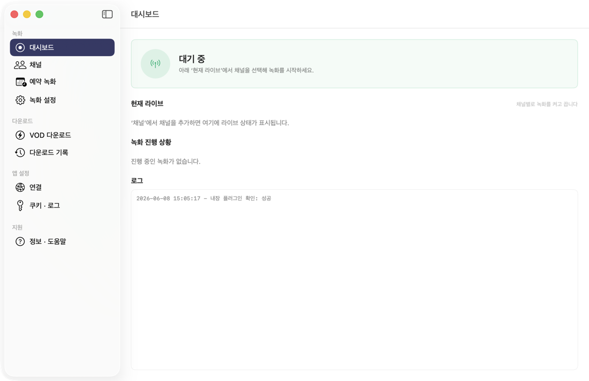
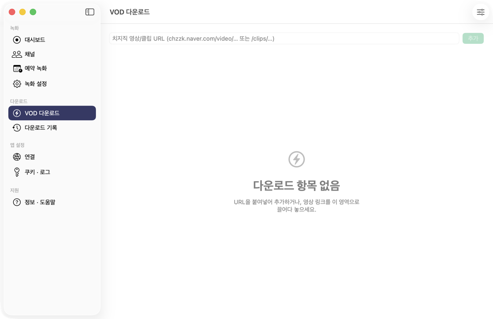
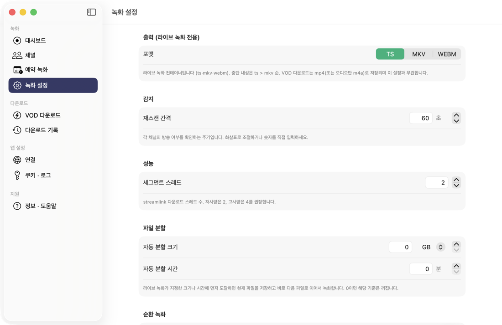
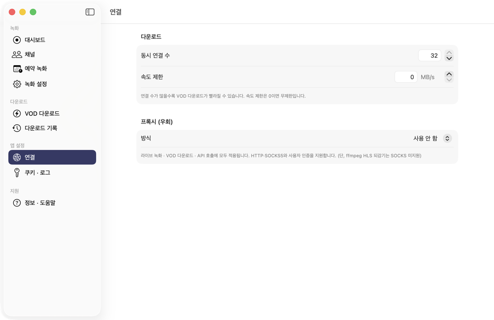

# Chzzk Downloader for Mac

치지직 라이브 녹화와 VOD/클립 다운로드를 한 화면에서 관리하는 macOS용 네이티브 앱입니다.
터미널 명령을 직접 다루지 않아도 채널 등록, 자동 녹화, 예약 녹화, VOD 다운로드, 다운로드 기록 관리를 앱 안에서 처리할 수 있습니다.

## 화면

| 대시보드 | VOD · 클립 다운로드 |
| :---: | :---: |
|  |  |
| **녹화 설정** | **연결 · 프록시** |
|  |  |

## 주요 기능

- 라이브 자동 녹화: 등록한 채널이 방송을 시작하면 자동으로 녹화합니다.
- 채널별 설정: 저장 폴더, 녹화 화질, 출력 형식을 채널마다 지정할 수 있습니다.
- 예약 녹화: 특정 시간에 녹화를 시작하거나, 다음 방송이 켜질 때까지 대기하는 원샷 예약을 지원합니다.
- 파일 분할: 녹화 중 파일 크기나 시간 기준으로 자동 분할할 수 있습니다.
- VOD/클립 다운로드: `chzzk.naver.com/video/...` 및 `/clips/...` 주소를 붙여 넣고 원하는 화질로 저장합니다.
- 빠른 병렬 다운로드: 직접 MP4 다운로드는 여러 연결로 나누어 받아 속도 저하를 줄입니다.
- 구간 다운로드: 영상에서 원하는 구간만 골라 빠르게 저장할 수 있습니다.
- 다운로드 기록: 실패하거나 중단된 항목은 기록에서 새로 다시 받을 수 있습니다.
- 브라우저 쿠키 불러오기: Chrome, Whale, Edge, Brave, Firefox, Safari의 `NID_AUT` / `NID_SES` 쿠키를 앱에서 불러올 수 있습니다.
- HEVC/AV1 인코딩: Apple Silicon 하드웨어 인코더를 포함한 ffmpeg 인코딩 옵션을 제공합니다.

## 필요 환경

- macOS 14 이상
- `ffmpeg`
- `streamlink`

Homebrew와 pipx를 쓰는 경우:

```bash
brew install ffmpeg
pipx install streamlink
```

앱은 일반적인 Homebrew 경로와 `PATH`에서 필요한 도구를 자동으로 찾습니다.

## 다운로드 및 실행

릴리즈에서 `ChzzkDownloaderForMac-<version>.dmg` 파일을 내려받은 뒤 앱을 `Applications` 폴더로 옮기면 됩니다.

현재 배포본은 Apple 공증을 받지 않은 ad-hoc signed 앱입니다. macOS에서 처음 실행할 때 경고가 나오면 Finder에서 앱을 우클릭한 뒤 **열기**를 선택하세요.

필요하면 다음 명령으로 격리 속성을 제거할 수 있습니다.

```bash
xattr -dr com.apple.quarantine "/Applications/Chzzk Downloader for Mac.app"
```

## 쿠키 안내

성인 인증이 필요한 VOD나 일부 제한 콘텐츠는 네이버 로그인 쿠키가 필요합니다. 앱의 쿠키 설정 화면에서 브라우저 쿠키를 불러오거나 직접 `NID_AUT`, `NID_SES` 값을 입력하세요.

쿠키는 시간이 지나면 만료될 수 있으므로 인증 실패가 나오면 쿠키를 다시 불러오면 됩니다.

## 참고

이 프로젝트는 NAVER 또는 CHZZK와 관련 없는 비공식, 비상업용 도구입니다. 녹화 및 다운로드한 콘텐츠의 사용 책임은 사용자에게 있습니다.

## 라이선스

Copyright (C) 2026 sbin0204

이 프로그램은 자유 소프트웨어입니다. **GNU General Public License v3.0**(GPLv3) 조건에 따라 재배포·수정할 수 있습니다. 전체 라이선스 본문은 [`LICENSE`](LICENSE)를 참고하세요. 번들된 오픈소스 구성요소(Sparkle, Streamlink 플러그인 등)의 고지는 [`THIRD_PARTY_NOTICES.md`](THIRD_PARTY_NOTICES.md)에 있습니다.

This program is free software: you can redistribute it and/or modify it under the terms of the GNU General Public License v3.0 as published by the Free Software Foundation. It is distributed WITHOUT ANY WARRANTY. See [`LICENSE`](LICENSE) for details.
